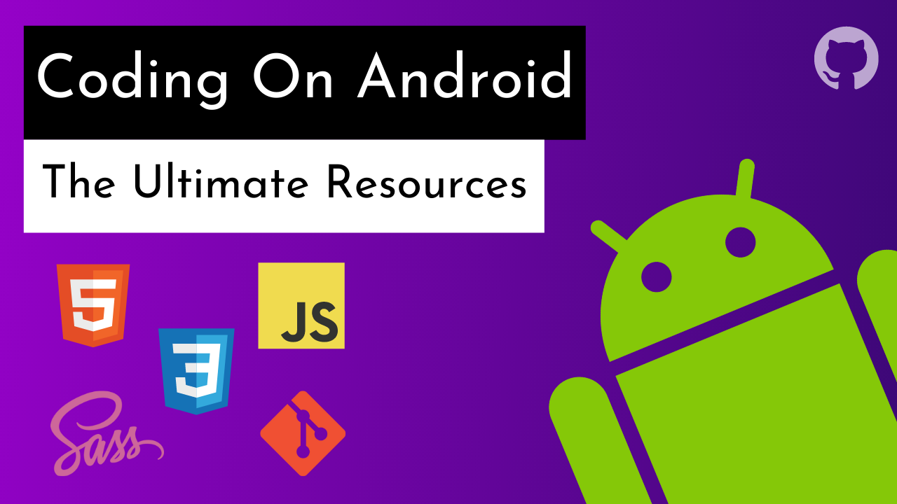
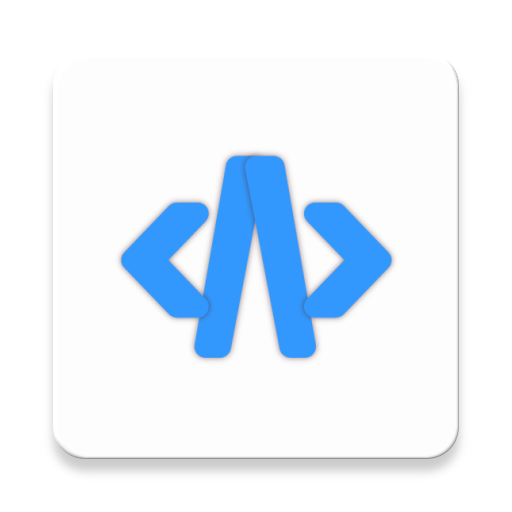
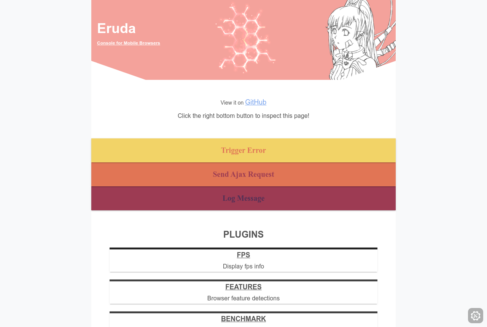
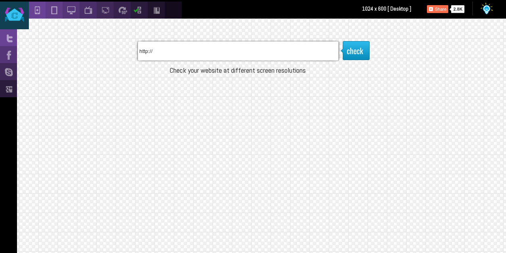

# The Ultimate Resources To Code On Android

## Table Of Contents

- [Introduction](#introduction)
- [Disclaimer](#disclaimer)
- [Article](#article)
- [Code Editor](#code-editor)
- [Terminal](#terminal)
- [Browser](#browser)
- [Dev Tool](#dev-tool)
- [Desktop View](#desktop-view)

## Introduction

[(Back to top)](#table-of-contents)

Hi! I'm Vanza! I had coded on my Android for about six months and in this GitHub repo, I'm going to share everything you need to have to code on your Android device.

Here are some of the projects that I created on my Android device:

- [Profile Card Component](https://github.com/vanzasetia/profile-card-component) - a responsive card component
- [Huddle Landing Page with Single Introductory Section](https://github.com/vanzasetia/huddle-landing-page-with-single-introductory-section) - a responsive landing page
- [Huddle Landing Page with Alternating Feature Blocks](https://github.com/vanzasetia/huddle-landing-page-with-alternating-feature-blocks) - a responsive landing page

> All the projects that I list are coming from the [Frontend Mentor challenges](https://www.frontendmentor.io/challenges).

## Disclaimer

[(Back to top)](#table-of-contents)

The resources that I'm going to show are mainly for front-end web development. But, it's possible to do some other stuff like Python, etc.

## Article

[(Back to top)](#table-of-contents)

<!--  -->

The article is going to cover what code editor you should use, how to use the terminal, what browser to use, how to implement the dev tool on your project, view your website on multiple screen sizes, and **much more!**

## Code Editor

[(Back to top)](#table-of-contents)

### 1. Acode (Recommended)

Acode is a freemium and open source code editor developed by foxdebug (a.k.a. [Ajit Kumar - deadlyjack](https://github.com/deadlyjack/) on GitHub).

#### Links

 

 

### 2. Spck Editor

Spck Editor is free and very powerful, code editor for front-end web development.

#### Links

 

## Terminal

[(Back to top)](#table-of-contents)

### Termux

> Termux is an Android terminal emulator and Linux environment application that works directly with no rooting or setup required.   \- From the [Termux Wiki main page](https://wiki.termux.com/wiki/Main_Page)

#### Links

 

 

## Browser

[(Back to top)](#table-of-contents)

### 1. Google Chrome (Recommended)

#### Links

 

### 2. Firefox

#### Links

 

 

### 3. Brave

#### Links

 

 

## Dev Tool

[(Back to top)](#table-of-contents)

### Eruda

#### Links

 

## Desktop View

[(Back to top)](#table-of-contents)

### Responsive Testing Tool

#### Links

